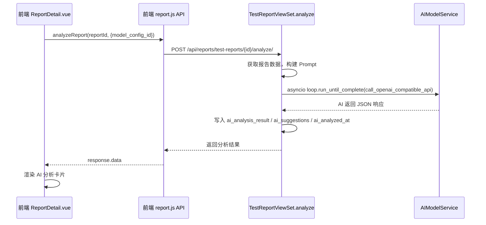

## 用户需求

为测试报告添加 AI 智能分析功能，允许用户在查看报告详情时选择已配置的大模型，触发 AI 对测试报告进行智能分析总结，并将分析结果持久化显示在报告详情页。

## 产品概述

在现有测试报告详情页（统一管理 → 测试报告 → 报告详情）中，新增 AI 智能分析模块。用户可从已配置的大模型列表中选择模型，点击"开始分析"后 AI 自动读取报告数据（包括测试结果、用例详情、失败信息等），生成分析总结和修复建议，结果持久化存储并展示在报告详情页的专属卡片中。

## 核心功能

- **大模型选择**：下拉展示系统中已启用的 AI 模型配置列表（复用 `AIModelConfig`），用户选择后触发分析
- **AI 分析接口**：后端新增 `analyze` action，读取报告完整数据，构建分析 Prompt，调用选定的 AI 模型，将结果写入 `ai_analysis_result`、`ai_suggestions`、`ai_analyzed_at` 字段
- **前端分析面板**：报告详情页新增"AI 智能分析"卡片，展示分析状态（未分析 / 分析中 / 已分析时间戳）、分析总结内容、修复建议内容，支持重新分析
- **报告列表 AI 标识**：列表页对已完成 AI 分析的报告显示图标标识

## 技术栈

- 后端：Django REST Framework，复用 `AIModelService.call_openai_compatible_api`，同步视图中通过 `asyncio.new_event_loop() + loop.run_until_complete()` 调用异步 AI 接口（与项目其他 view 保持一致）
- 前端：Vue 3 + Element Plus，在 `ReportDetail.vue` 中新增 AI 分析卡片，`report.js` 中新增 API 函数

## 实现方案

### 后端 —— 新增 `analyze` action

在 `TestReportViewSet` 中新增 `@action(detail=True, methods=['post'])` 的 `analyze` 接口：

1. 接收请求体中的 `model_config_id`（可选，不传则取第一个可用配置）
2. 从 `AIModelConfig` 中查找对应配置（`is_active=True`）
3. 构建 Prompt：将报告的 `summary`、`content`（或 `test_details`）序列化为结构化文本传入 AI
4. 通过 `asyncio.new_event_loop()` 调用 `AIModelService.call_openai_compatible_api`
5. 将结果写入报告的 `ai_analysis_result`、`ai_suggestions`、`ai_analyzed_at` 三个字段并保存

Prompt 设计为两段式：系统角色（测试分析专家）+ 用户消息（报告详细数据），输出格式要求 JSON（含 `analysis` 和 `suggestions` 两个字段），方便前端解析分别展示。

另新增 `GET /ai-models/` 端点（`list_ai_models` action）以便前端获取可用模型列表，直接复用 requirement_analysis 已有的 `/api/requirement-analysis/api/ai-models/` 接口，无需重复开发。

### 前端 —— 报告详情页扩展

在 `ReportDetail.vue` 中新增 `<el-card>` AI 分析卡片，包含：

- 顶部：模型选择下拉（`el-select`）+ "开始 AI 分析"按钮（带 loading 状态）
- 已分析状态区：分析时间、分析总结、修复建议（分别用不同样式展示）
- 未分析状态区：空状态提示

在 `report.js` 中新增 `analyzeReport(id, data)` 和 `getAIModelList()` 两个 API 函数。

## 实现注意事项

- **Prompt 截断保护**：报告 `content` 可能包含大量用例数据，需对传入 AI 的文本按 `max_tokens` 做长度截断，避免超出模型上下文窗口
- **AI 分析幂等性**：已有分析结果时，前端应提示"已分析，是否重新分析"，避免重复调用浪费 Token
- **错误处理**：AI 接口调用失败时后端返回明确的错误信息，前端 `ElMessage.error` 展示，不影响报告查看
- **JSON 解析容错**：AI 返回内容可能不是严格 JSON，需在解析失败时回退为纯文本展示在 `ai_analysis_result`
- **模型列表接口复用**：直接调用已有的 `/api/requirement-analysis/api/ai-models/?is_active=true`，不新增重复接口

## 架构设计



## 目录结构

```
apps/reports/
├── views.py          # [MODIFY] 新增 analyze @action，接收 model_config_id，
│                     # 构建 Prompt，调用 AIModelService，保存结果到三个 AI 字段
└── serializers.py    # [MODIFY] TestReportDetailSerializer 中确认已包含 ai_* 字段（已有，无需修改）

frontend/src/
├── api/unified/
│   └── report.js     # [MODIFY] 新增 analyzeReport(id, data) 函数；
│                     # 新增 getAIModelList() 调用 requirement-analysis 模型列表接口
└── views/unified/reports/
    └── ReportDetail.vue  # [MODIFY] 新增 AI 分析卡片：模型选择下拉 + 分析按钮 +
                          # 已分析结果展示区（分析总结 + 修复建议）+ 未分析空状态
```